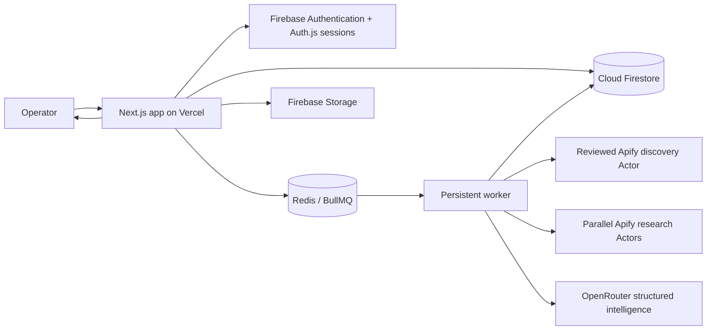

# Architecture

## System shape

The Next.js application owns server-rendered pages, authenticated APIs, permission checks, request validation, short mutations, and job creation. Search processing happens in the worker so Apify polling, normalization, enrichment, and scoring do not depend on a serverless request remaining alive.

Cloud Firestore is the source of truth for users, workspaces, billing, searches, jobs, results, and the append-only audit ledger. Firebase Authentication owns password identities, Auth.js issues the application session, and Firebase Storage holds private expiring export artifacts. Browser access to Firestore and Storage is denied; all product access passes through authenticated server APIs and Admin SDK IAM.

## Search lifecycle

1. Validate the audience brief, filters, mode, lawful-purpose fields, requested lead count, and available credits.
2. Create the search and job in one database transaction; reserve credits in the append-only ledger.
3. Enqueue only the job identifier—never raw contact data—in BullMQ.
4. Resolve the configured, reviewed discovery Actor for B2B or B2C and record the actor/source metadata.
5. For each discovered B2B company, fan out reviewed Apify research Actors under company/actor semaphores. Retry with bounded attempts, deduplicate evidence, cache normalized bundles, and clean provider artifacts.
6. Normalize the discovery dataset and research bundles into canonical company, contact, signal, technology, and evidence shapes with timestamps and confidence.
7. Deduplicate companies and people with deterministic normalized keys before fuzzy or AI-assisted comparison.
8. Apply deterministic eligibility and base scoring first. OpenRouter structured analysis runs concurrently in small ordered windows under a process-wide semaphore, explicit per-call bounds, and a cooperative job budget; budget exhaustion switches remaining records to deterministic analysis rather than orphaning the job.
9. Persist canonical companies/people and their website analysis, buying signals, evidence, timeline, tasks, and research reports. Attach an immutable non-sensitive profile snapshot to each result, update leased-job progress, reconcile actual credit usage, and create a notification.
10. Export through an audited, permission-checked path as PDF, CSV, Excel, JSON, CRM-ready CSV, or an AI intelligence report; large artifacts expire from storage.

## Degraded modes

- `DEMO_MODE=true`: deterministic data, analysis, job progress, and exports; intended for local/product evaluation.
- Firestore unavailable: read-only UI fixtures remain available, but persistent mutations report a clear degraded state.
- Firebase Authentication unavailable: account creation and password sign-in fail closed; existing application sessions continue only until their configured expiry.
- Firebase Storage unavailable: searches and saved data continue, but durable export upload/download is unavailable and health reports the storage component as degraded.
- Redis unavailable: development may process a bounded job inline. Production never runs a search inline; an ambiguous/claimed enqueue remains pending, while a confirmed unclaimed job is failed and its reservation released.
- Apify unavailable: the job records a retryable provider error. OpenRouter timeout, refusal, schema failure, or analysis-budget exhaustion uses the auditable deterministic analysis and is recorded in job metrics.

## Multi-tenancy

Every mutable business entity belongs to a workspace. Authorization is checked by workspace membership and role at the service boundary, not only in the UI. Unique constraints include workspace scope where appropriate. Admin access is separate from workspace ownership and every admin mutation is audited.

## Deployment

Vercel hosts the Next.js application. BullMQ requires a continuously running Node.js worker and should be deployed from the same source image to a container runtime. Both processes share the same Firebase project, Redis, encryption configuration, and provider secrets. Vercel previews should use an isolated Firebase project or demo mode; never point untrusted previews at production data.
